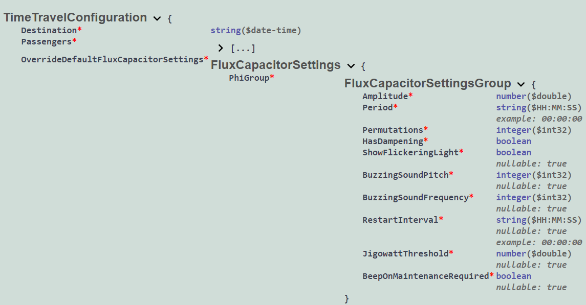
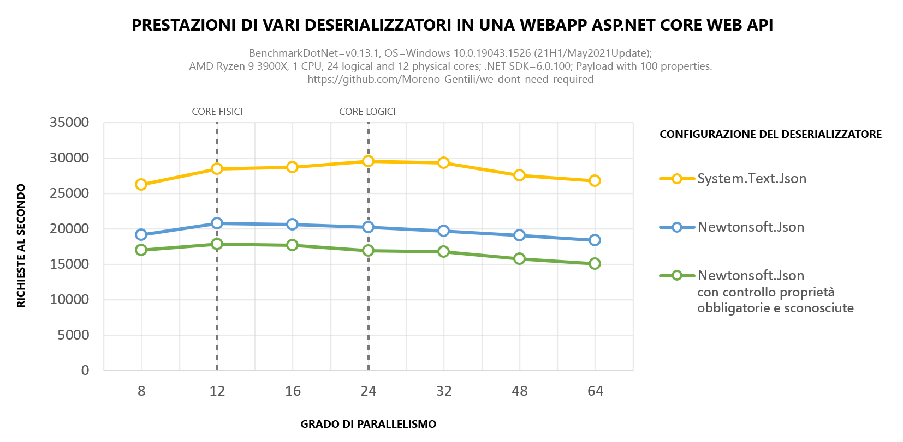

# We don't need [Required]
Il progetto [WeDontNeedRequired](src/WeDontNeedRequired/) è un'applicazione ASP.NET Core per .NET 6 in cui il deserializzazione [Newtonsoft.Json](https://www.nuget.org/packages/Newtonsoft.Json/) è configurato per fare in modo che il client:
 * **Includa** tutte le proprietà presenti nel [payload della richiesta](src/WeDontNeedRequired/Models/TimeTravelConfiguration.cs), comprese quelle non obbligatorie che dovranno esplicitamente essere impostate a `null`. Questo comportamento è ottenuto con un `ContractResolver` personalizzato ([vedi il codice](src/WeDontNeedRequired/Serialization/RequirePropertiesContractResolver.cs#L17));
 * **Escluda** ogni altra proprietà che rechi un nome non previsto nel payload della richiesta. Questo comportamento è ottenuto impostando la proprietà `MissingMemberHandling` del deserializzatore ([vedi il codice](src/WeDontNeedRequired/Startup.cs#L32)).

Se il client vìola queste regole, ottiene una risposta con status code `400 Bad Request` che gli evidenzia gli errori presenti nel payload. In questo modo riesce subito ad accorgersi di eventuali errori di digitazione nel nome delle proprietà o del loro errato annidamento all'interno del payload.

In questo modo, l'uso dell'attributo `[Required]` diventa superfluo e può essere omesso.

> Chiarimento sulla nomenclatura: una proprietà è **obbligatoria** quando non ammette valori `null`. Una proprietà è **richiesta** quando il client deve esplicitamente fornirla e valorizzarla nel payload JSON che invia all'applicazione. Questo progetto mostra come **richiedere** tutte le proprietà, sia obbligatorie che non obbligatorie.

Il progetto include un [SwaggerRequiredPropertiesSchemaFilter](src/WeDontNeedRequired/Swagger/SwaggerRequiredPropertiesSchemaFilter.cs) per fare in modo che la documentazione Swagger sia coerente con il comportamento del deserializzatore. **Dato che ogni proprietà è richiesta, viene contrassegnata con un asterisco rosso**. Le proprietà non obbligatorie sono annotate con `nullable: true`.



Se preferisci invece che nella documentazione Swagger l'asterisco rosso sia posto solo di fianco alle proprietà obbligatorie, allora decommenta la [riga 14 dello schema filter](src/WeDontNeedRequired/Swagger/SwaggerRequiredPropertiesSchemaFilter.cs#L14).


## Benchmark
Il progetto [WeDontNeedRequired.Benchmark](src/WeDontNeedRequired.Benchmark/) usa [BenchmarkDotNet](https://benchmarkdotnet.org/articles/overview.html) per quantificare le capacità prestazionali dell'applicazione [WeDontNeedRequired](src/WeDontNeedRequired/) con varie configurazioni del deserializzatore.

 * <font color="gold">▇</font> System.Text.Json (il default per ASP.NET Core 3+);
 * <font color="dodgerblue">▇</font> Newtonsoft.Json;
 * <font color="limegreen">▇</font> Newtonsoft.Json con obbligo di inclusione delle proprietà obbligatorie ed esclusione di proprietà sconosciute;

Puoi eseguire il benchmark esegendo il seguente comando nella directory [src/WeDontNeedRequired.Benchmark/](src/WeDontNeedRequired.Benchmark/)

```
dotnet run -c Release
```

> **Attenzione**: il benchmark è intensivo per la CPU e potrebbe richiedere svariate decine di minuti in base alle caratteristiche hardware del tuo PC.

Il seguente grafico visualizza i risultati ottenuti. Puoi vedere i dati grezzi nel file excel [Benchmark.xlsx](Benchmark.xlsx).



Usare questa soluzione comporta una riduzione di circa il 30% sul throughput grezzo ottenibile con un'applicazione ASP.NET Core "vuota", cioè che non implementa alcuna funzionalità.

Ipoteticamente, le prestazioni potrebbero migliorare con .NET 7, quando anche `System.Text.Json` permetterà il controllo delle proprietà nel payload.

> Segui la [issue #63762 di dotnet/runtime su GitHub](https://github.com/dotnet/runtime/issues/63762) che tiene traccia delle funzionalità pianificate per `System.Text.Json` in .NET 7.